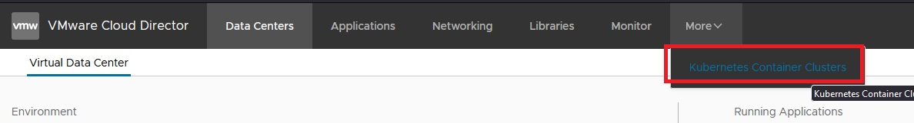
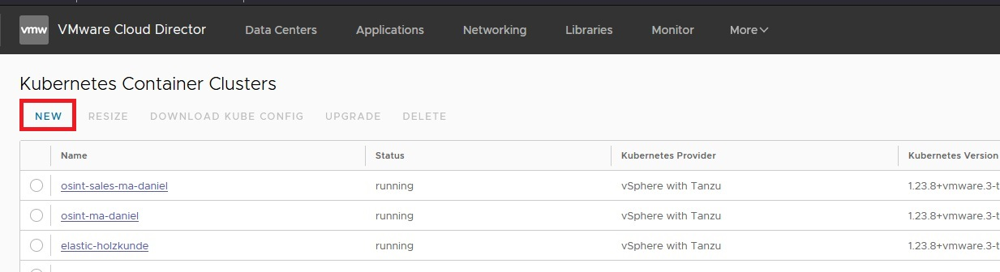
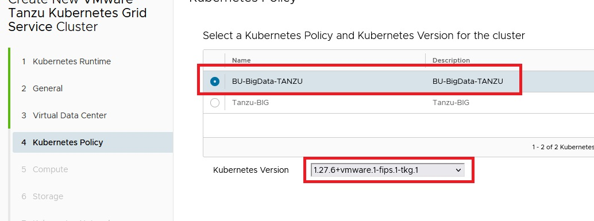
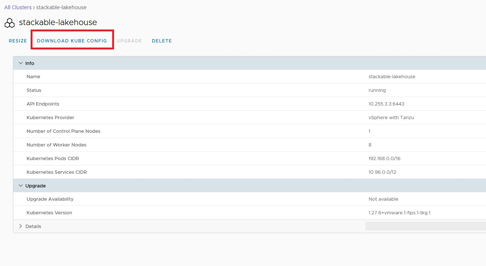
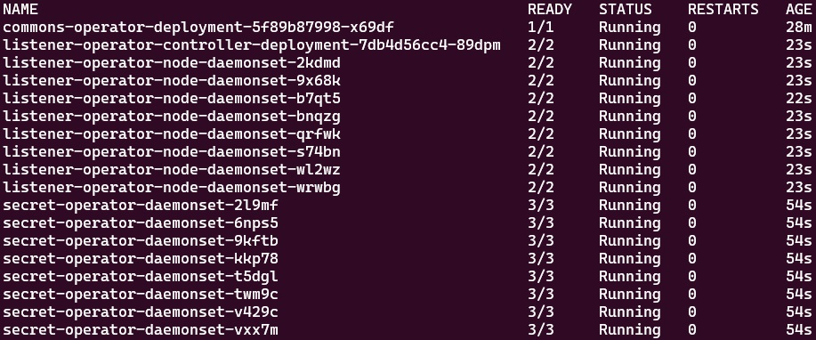

# Guide for setting up the k8s-cluster

# Prerequisites
- Get access to the evoila-Lab. Refer to the [internal Sharepoint-Site](https://evoilade.sharepoint.com/sites/intranet/knowledge/evoila-lab/SitePages/Zugang-beantragen.aspx).
- Contact the BU-Lab-Admin to get access to the [VMware Cloud Director](https://vcd.evoila-lab.work/login/?service=tenant:bu-bigdata&redirectTo=%2Ftenant%2Fbu-bigdata%2F).

# Setting up the K8s-Cluster
- Step 1: Navigate to the K8s-Cluster-Overview
  
- Step 2: If there is already a cluster you want to use, go to Step 4, otherwise, click on "NEW" to create a new cluster:
  
- Step 3: Follow the interface:
    - Chose the following config on Step 4.Stackable needs at least version `1.26` of kubernetes
    
    - Chose the needed amount of nodes. The count of the nodes can be changed later through the interface, but not the size. Chose `best-effort-medium` for a test setup and `best-effort-large` for a production setup. As a starting point, select 1 Control Plane Node and 8 Worker Nodes
    - Select the default settings for the other steps
- Step 4: Wait for the deployment. Afterwards, click on the given name for your cluster and download the kube-config:
  
- Step 5: In your preferred CLI (we will use `bash` here), make sure you have everthing install listed in the [readme](/README.md) and set the kube-config via `export KUBECONFIG=path/to/kubeconfig`. Append this command to your `bashrc` to have it applied on start-up
- Step 6: In case you work on a cluster which is alread configured, you're done (type `kubectl get pods` to see running pods). Otherwise, execute the following command:
  ```
  kubectl label --overwrite ns default pod-security.kubernetes.io/enforce=privileged pod-security.kubernetes.io/warn=baseline pod-security.kubernetes.io/audit=baseline
  ```
  This is needed to create pods regardless of possible privilege escalations, but shows a warning if there are any. See [this link](https://kubernetes.io/docs/concepts/security/pod-security-standards/) for further information
- Step 7: Add the Stackable Helm repository and install the basic operators, which are needed for almost everything:
  ```
  helm repo add stackable-stable https://repo.stackable.tech/repository/helm-stable/
  helm install --wait commons-operator stackable-stable/commons-operator --version 23.11.0
  helm install --wait secret-operator stackable-stable/secret-operator --version 23.11.0
  helm install --wait listener-operator stackable-stable/listener-operator --version 23.11.0
  ```
  After the installation, type `kubectl get pods` and you should see something similar to the following screenshot (the count of `secret-operator-daemonset` and `listener-operator-node-daemonset` depends on your number of nodes):
  
- Step 8: Be proud, you are ready to use kubernetes and stackable :)